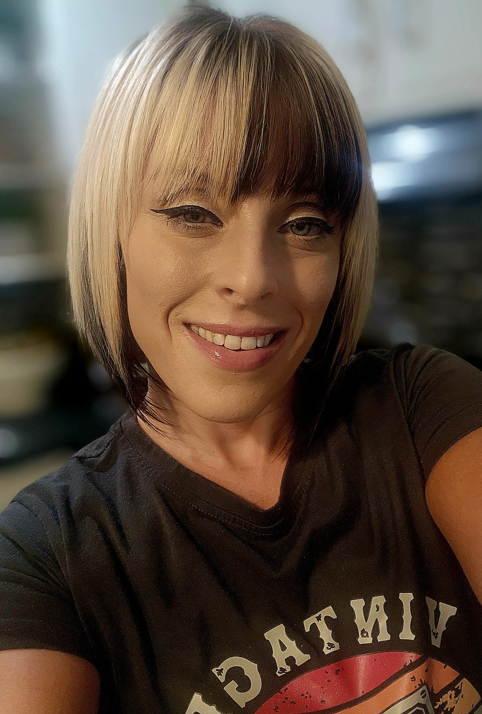

  

<h1 align="center">💻 Marilyn Stephens</h1>
<h3 align="center" style="font-weight:400; color:#555;">
  Network Administrator • Security Specialist
</h3>

  🔐 CompTIA A+ • Security+ • CySA+ • <i>Pursuing CASP+</i> • Active Secret Clearance 
  🎯 <i>Future Focus:</i> Advanced Cybersecurity + Artificial Intelligence

---

  
  
  
  
  
  

---

## 🚀 About Me
I’m building a career at the intersection of **enterprise security** and **artificial intelligence** — safeguarding today’s systems while designing intelligent defenses for tomorrow’s threats.  

My background spans **DoD data security**, **privacy‑first platforms**, and **TEMPEST‑compliant environments**. I bring a blend of **hands‑on technical expertise** and **strategic insight** from my experience as a business owner.

---

## 🛠 Core Competencies

| **Technical Skills**              | **Security Focus**                  | **Business Skills**                  |
|-----------------------------------|-------------------------------------|--------------------------------------|
| Storage systems (SAN/NAS)         | Secure data transfer, compliance    | Client engagement & relationship mgmt|
| Infrastructure optimization       | Risk assessment & mitigation        | Project leadership                   |
| AI integration into workflows     | Threat detection & response         | Operational growth strategies        |

---

## 📌 Featured Projects

### 🌐 Humanity — Privacy‑Focused Social Platform  
A community‑first platform built to foster meaningful interactions with **security and trust** at the forefront.  

- Repo: <a href="https://github.com/marilyn2015/Humanity" target="_blank" rel="noopener noreferrer">github.com/marilyn2015/Humanity</a>  
- Overview: <a href="https://marilyn2015.github.io/projects/humanity" target="_blank" rel="noopener noreferrer">Project Page</a>  

> Explore all projects in the <a href="./projects.md" target="_blank" rel="noopener noreferrer">Projects</a> section.

---

## 🎓 Education & Certifications

  
  
  

🛠 <b>Pursuing CASP+</b> — In progress  
📚 <b>Artificial Intelligence Coursework</b> — Starts Sept 2025  
🔒 <b>Active Secret Clearance</b>

---

## 🎯 Goals

- ✅ Attain **CASP+** certification to strengthen enterprise security and risk management expertise  
- ✅ Build deep skills in **AI** and its applications for cybersecurity  
- ✅ Lead projects that integrate AI to enhance threat detection and resilience  

---

## 📫 Connect With Me

  
  
  

<i>Always open to connecting with fellow security professionals and innovators in AI.</i>

