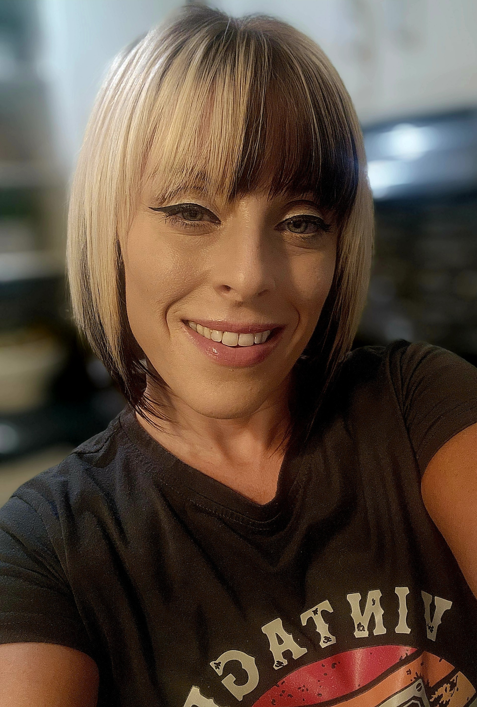

  

<h1 align="center">Marilyn Stephens</h1>
<h3 align="center" style="font-weight:400; color:#555;">
  Computer Systems Analyst | DoD Support | Cybersecurity | Secure Systems Operations
</h3>

  CompTIA A+ • Security+ • CySA+ • Active Secret Clearance

  
  
  
  

---

## Professional Summary

Cybersecurity and systems professional with experience supporting Department of Defense and policy-regulated environments, specializing in secure data handling, systems administration, mission-critical operations, and compliance-driven workflows. Currently supporting United States Air Force operations in a secure environment, with hands-on experience in mission data validation, controlled system workflows, radio support operations, TEMPEST-related support, and monthly system patching and hardening.

In addition to formal systems work, I have expanded my technical skill set through self-directed development in React, Firebase, cloud-based tooling, and privacy-focused identity systems. I am especially interested in secure architecture, emerging identity technologies, and the practical use of AI tools to improve workflows and technical efficiency.

---

## Core Strengths

- Secure data handling and mission-critical system support
- DoD and Air Force compliance-driven operations
- Systems administration and operational troubleshooting
- TEMPEST package support and secure facility awareness
- Monthly patching, system updates, and security hardening
- Technical documentation, process accuracy, and operational reliability
- Self-directed software development and technical problem solving

---

## Professional Experience Highlights

### Computer Systems Analyst  
**Bering Sea Environmental LLC** | **Sep 2023 – Present**

- Manage the secure handling, transfer, and validation of mission data across ICADS and PCDS environments
- Perform system diagnostics and resolve data-flow issues to support mission continuity
- Support classified and compliance-sensitive workflows with strong focus on confidentiality and integrity
- Oversee radio communications and assigned frequencies in support of LMOC flight operations
- Prepare, verify, and deliver mission data used for pilot debriefs and training support
- Contributed to TEMPEST package preparation and supported secure facility transition efforts
- Perform monthly patching, system updates, and security hardening in alignment with DoD directives

**Tools & Platforms:** PCDS, ANGEL, ICADS, SolarWinds, MSCT

### Founder / Owner  
**Virginia Natural Cleaning Solutions** | **Aug 2013 – Aug 2023**

- Built and scaled a service-based business from the ground up
- Managed marketing, customer acquisition, vendor coordination, quoting, bookkeeping, and inventory
- Earned SWaM certification and secured HUD-related inspection and compliance-focused contracts
- Grew operations from a small initial client base into a stable revenue-generating company

### Leasing & Operations Experience

Previous roles include **Lead Leasing Consultant at SL Nusbaum Realty Co.** and **Leasing Consultant at Seminole Trail Management LLC**, with experience in leasing operations, compliance documentation, resident support, collections, and property workflow management. Achievements include increasing occupancy from 87% to 96% in two months and operating a property independently during an ownership transition.

---

## Certifications

- CompTIA A+
- CompTIA Security+
- CompTIA CySA+
- Active Secret Clearance

  <a href="https://www.credly.com/users/marilynstephens" target="_blank" rel="noopener noreferrer">
    View certifications on Credly
  </a>

---

## Technical Interests

- Cybersecurity operations
- Secure identity systems
- Privacy-focused platforms
- Artificial intelligence tools
- Full-stack development
- Emerging technology and secure architecture

---

## Featured Project

### Hash Humanity

Privacy-focused social platform centered on proof of personhood, zero-knowledge concepts, and modern web technologies. This project reflects my interest in secure identity, authenticity in online systems, and building privacy-aware platforms.

- Repo: <a href="https://github.com/Marilyn2015/Marilyn2015" target="_blank" rel="noopener noreferrer">GitHub Repository</a>
- Resume Site: <a href="https://marilyn2015.github.io/Resume/" target="_blank" rel="noopener noreferrer">View Resume</a>

---

## Connect

- Email: <a href="mailto:marilyn_stephens@hotmail.com">marilyn_stephens@hotmail.com</a>
- LinkedIn: <a href="https://www.linkedin.com/in/marilynstephens/" target="_blank" rel="noopener noreferrer">linkedin.com/in/marilynstephens</a>
- GitHub: <a href="https://github.com/Marilyn2015" target="_blank" rel="noopener noreferrer">github.com/Marilyn2015</a>
